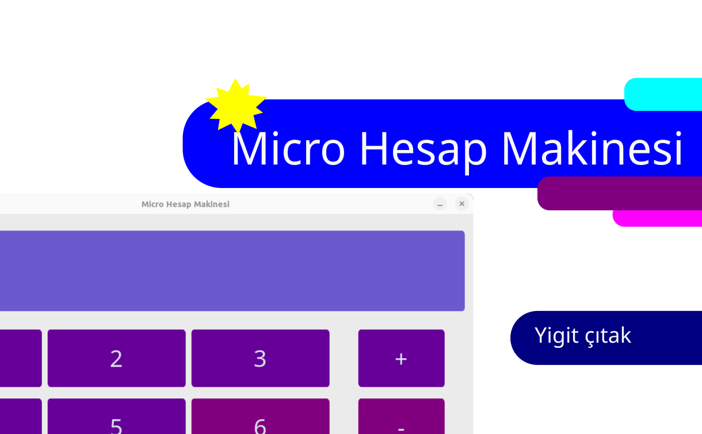

# Micro Hesap Makinesi
This is a calculator program I made. I preferred to prepare and design it according to the Micropad concept I had created before. and this was done with Customtkinter library

 

